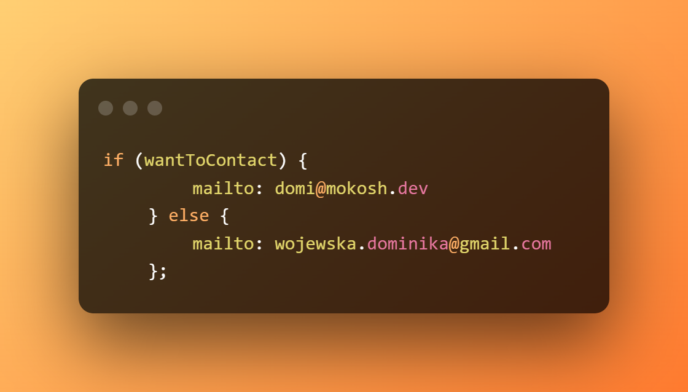

# About me
<h2>👋 Hello there, I'm Domi</h2>
 I'm working at eStoreLabs as a junior frontend developer and at Syntro AI startup as head of product and UX/UI/frontend. You can also hire me as a freelancer to design and code a homepage for you.
 I'm also open to collaborate on beginner-friendly projects, that would be super cool :D

# Contact
   
    discord: Domi#3442
 
    
# Portfolio
<h3><a href="http://mokosh.dev">mokosh.dev</a></h3>

# What am I learning at the moment
* [JavaScript Algorithms and Data Structures - FreeCodeCamp](https://www.freecodecamp.org/Domi_)
* [Front-End Engineer career path - CodeCamy](https://www.codecademy.com/profiles/the_witch)
* React

# What am I building now
I'm ~~currently working on two projects~~, one is a home page for local business, the other is a gallery with art by a friend of mine.
1) Massage studio caled "Masaż Mistrza" - project repo [massage studio in Warsaw](https://github.com/WitchDevelops/Massage-studio-masaz-mistrza)
2) Art gallery by Sofia Banchenko - project repo [modern art by Sofia Banchenko](https://github.com/WitchDevelops/Artgallery-Sofiadali)

These've been put on hold, as I'm working on a homepage for our startup: SYNTRO.

# My tech stack
<table>
    <tr>
        <th>Languages</th>
        <th>Frameworks</th>
        <th>Coding tools</th>
        <th>Design tools</th>
    </tr>
    <tr>
        <td>HTML</td>
        <td>Angular (basics)</td>
        <td>Git</td>
        <td>Figma</td>
    </tr>
    <tr>
        <td>CSS (SASS)</td>
        <td>React (leaarning)</td>
        <td>Angular CLI</td>
        <td>Canva</td>
    </tr>
        <td>JavaScript</td>
        <td></td>
        <td>VS code</td>
        <td>Photoshop</td>
    <tr>
        <td>TypeScript (learning)</td>
        <td></td>
        <td></td>
        <td>Illustrator</td>
    </tr>
    
 </table>

# Stats

<!---
WitchDevelops/WitchDevelops is a ✨ special ✨ repository because its `README.md` (this file) appears on your GitHub profile.
You can click the Preview link to take a look at your changes.
--->
